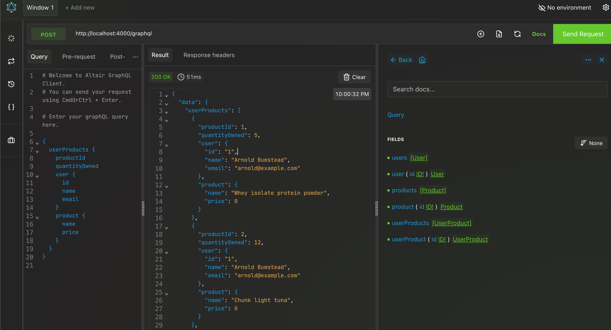

# GraphQL Microservice

This project is a GraphQL-based microservice designed to provide a flexible and efficient API for managing users, products, and their relationships. It is built using Node.js, Express, and Apollo Server.

## Features

- **User Management**: Query and manage user data, including adding new users.
- **Product Management**: Query product data.
- **User-Product Relationships**: Query and manage relationships between users and products, such as ownership and quantity.

## Technologies Used

- **GraphQL**: For defining the schema and resolvers.
- **Apollo Server**: To handle GraphQL queries and mutations.
- **Express**: As the web server framework.
- **PostgreSQL**: For database storage and querying.
- **dotenv**: For managing environment variables.

## Setup Instructions

1. Clone the repository.
2. Install dependencies using `npm install`.
3. Set up a PostgreSQL database and configure the `.env` file with your database credentials.
4. Start the development server using `npm run dev`.

## Endpoints

- **GraphQL Playground**: Access the GraphQL Playground at `http://localhost:4000/graphql` to test queries and mutations.